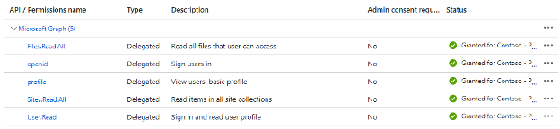
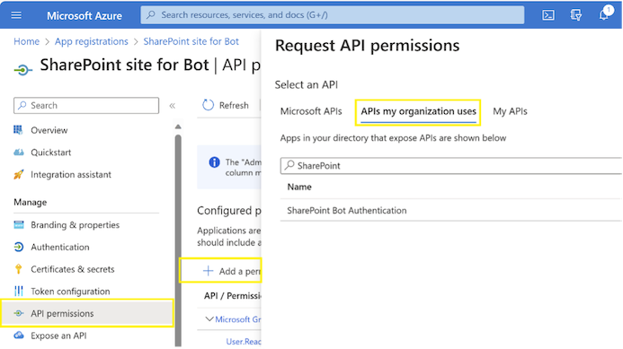
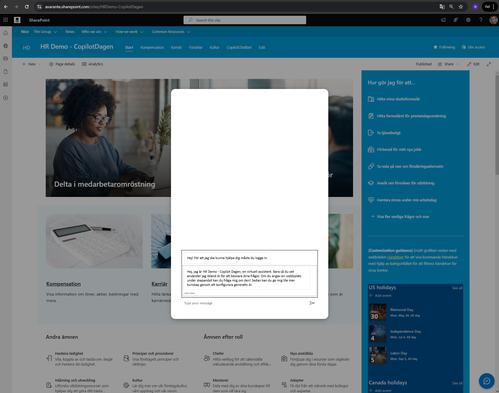
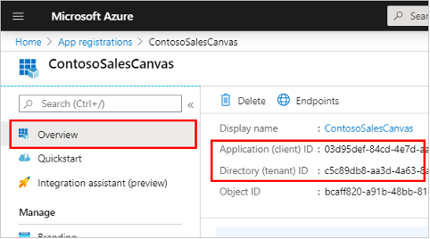
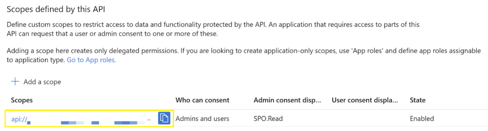
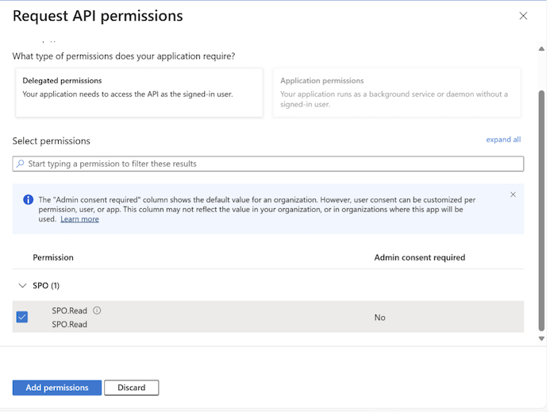
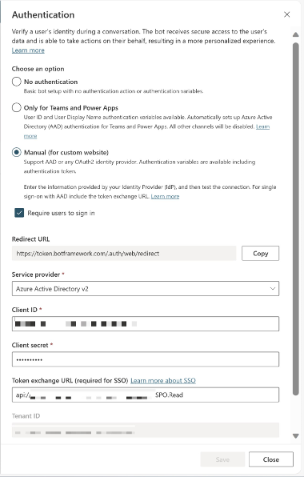

# Chatbubble Copilot Extension for SharePoint Online

A modern, enterprise-grade SharePoint Framework (SPFx) application customizer that seamlessly integrates Microsoft Bot Framework chatbots into SharePoint Online sites. Built with cutting-edge technologies and following Microsoft's latest design patterns.

## 🚀 Overview

This solution transforms your SharePoint experience by embedding intelligent chatbots with a native, Copilot-like interface. Perfect for IT support, HR assistance, knowledge management, and customer service scenarios across your Microsoft 365 environment.

### ✨ Key Features

- **🎨 Modern Fluent UI Integration** - Native Copilot-style interface using botframework-webchat-fluent-theme
- **🔐 Enterprise Security** - MSAL v4+ authentication with Azure AD SSO and token exchange
- **⚡ High Performance** - Optimized React components with memory leak prevention and error boundaries
- **📱 Responsive Design** - Mobile-friendly interface that adapts to all screen sizes
- **🛡️ Production Ready** - Comprehensive error handling, retry mechanisms, and graceful degradation
- **⚙️ Flexible Configuration** - SharePoint list or JSON-based configuration with hot-reload support
- **🌐 Multi-Tenant Ready** - Tenant-wide deployment with centralized management
- **💾 Session Persistence** - Automatically saves and restores chat sessions with 7-day history
- **📂 Session History Panel** - Side panel to browse and switch between previous conversations
- **📎 File Upload Support** - Drag & drop files with preview and multiple file selection
- **🗣️ Speech Integration** - Text-to-speech and speech-to-text capabilities
- **👤 Avatar System** - Bot and user avatars with customizable images and initials
- **⏰ Smart Timestamps** - Relative timestamps with intelligent message grouping
- **💬 Rich Interactions** - Typing indicators, suggested actions, and enhanced media support

### Screenshots

#### API Permissions Setup



#### Adding APIs in Azure AD



#### Chatbot Interface



#### Application Client ID in Azure



#### Custom Scopes for API



#### Scope Permissions Setup



#### Token Exchange URL Configuration



---

## 🛠️ Technology Stack

### **Frontend**
- **SharePoint Framework (SPFx) 1.21.1** - Latest SPFx with TypeScript 5.3 support
- **React 17** - Modern React patterns with hooks and error boundaries
- **Fluent UI v8** - Microsoft's design system for consistent UX
- **Bot Framework WebChat 4.18** - Latest WebChat with HTML-in-Markdown support
- **SCSS Modules** - Component-scoped styling with CSS custom properties

### **Authentication & Security**
- **MSAL Browser v4.22** - Microsoft Authentication Library with latest security features
- **Azure AD Integration** - Enterprise-grade identity and access management
- **OAuth 2.0 + PKCE** - Industry-standard secure authentication flow

### **Build & Development**
- **TypeScript 5.3** - Latest TypeScript with improved type safety
- **Gulp 4** - Modern build pipeline with parallel task execution
- **ESLint 8** - Code quality and consistency enforcement
- **Node.js 16-18** - LTS support for enterprise environments

---

## 💻 System Requirements & Compatibility

| Component                       | Requirement       | Status |
|--------------------------------|-------------------|--------|
| **SharePoint Online**          | Microsoft 365     | ✅ Full Support |
| **SharePoint Server 2019/2016** | On-premises       | ❌ Not Supported |
| **Node.js**                    | 16.13+ or 18.17+  | ✅ Tested |
| **Modern Browsers**            | Chrome, Edge, Firefox | ✅ Optimized |
| **Mobile Devices**             | iOS, Android      | ✅ Responsive |
| **SPFx Workbench**             | Hosted only       | ✅ Development |

### Browser Compatibility
- ✅ **Microsoft Edge** (Recommended)
- ✅ **Google Chrome** 
- ✅ **Mozilla Firefox**
- ✅ **Safari** (macOS/iOS)
- ❌ **Internet Explorer** (Deprecated)

*Refer to [SPFx Compatibility Matrix](https://aka.ms/spfx-matrix) for detailed version information.*

---

## 📋 Prerequisites

### **Required Access & Permissions**
- **Microsoft 365 Tenant** with SharePoint Online
- **Global Administrator** or **SharePoint Administrator** rights
- **Application Developer** permissions in Azure AD
- **App Catalog Administrator** access

### **Development Environment**
```bash
# Required versions
Node.js: 16.13.0+ or 18.17.1+
npm: 8.0.0+
gulp-cli: 2.3.0+

# Recommended tools
Visual Studio Code with SPFx extensions
SharePoint Framework Yeoman generator
```

### **Azure Resources**
- **Azure AD App Registration** with API permissions
- **Bot Framework** or **Power Virtual Agents** bot
- **Custom API scopes** configured for token exchange

### **SharePoint Setup**
- **Tenant App Catalog** site collection
- **Site Collection Administrator** rights
- **Modern SharePoint** sites (classic not supported)

---

## 🚀 Quick Start

### **1. Development Setup**
```bash
# Clone the repository
git clone <repository-url>
cd chatbubble-copilot-extension

# Install dependencies
npm install

# Start development server
gulp serve

# Build for production
npm run build
```

### **2. Build & Package**
```bash
# Production build
gulp bundle --ship
gulp package-solution --ship

# Output: sharepoint/solution/chatbubble-copilot-extension-sso.sppkg
```

### **3. Deploy to SharePoint**
1. Navigate to **Tenant App Catalog** (`<tenant>-admin.sharepoint.com`)
2. Upload the `.sppkg` file to **Apps for SharePoint**
3. Click **Deploy** and enable **Tenant-wide deployment**
4. Confirm API permission requests

### **4. Azure AD Configuration**
```powershell
# Required API permissions
- User.Read (Microsoft Graph)
- openid, profile, email (Azure AD)
- <your-custom-api-scope> (Your Bot API)
```

**Azure Portal Steps:**
1. Go to **Azure AD** > **App Registrations** 
2. Select your app > **API Permissions**
3. Add required permissions above
4. Click **Grant admin consent**

### **5. Configuration Setup**

#### **Option A: SharePoint List Configuration (Recommended)**
Create a list named `TenantWideExtensionsConfig` in your App Catalog:

| Column Name | Type | Description |
|-------------|------|-------------|
| `Title` | Single line of text | Configuration name |
| `BotURL` | Single line of text | Bot Framework endpoint |
| `BotName` | Single line of text | Display name in chat |
| `ButtonLabel` | Single line of text | Toggle button text |
| `BotAvatarImage` | Hyperlink | Avatar image URL |
| `BotAvatarInitials` | Single line of text | Fallback initials |
| `Greet` | Yes/No | Auto-greeting enabled |
| `CustomScope` | Single line of text | API authentication scope |
| `ClientID` | Single line of text | Azure AD App ID |
| `Authority` | Single line of text | Azure AD authority URL |

**Example Configuration:**
```json
{
  "Title": "Production Bot",
  "BotURL": "https://your-bot.azurewebsites.net/api/messages",
  "BotName": "IT Support Assistant",
  "ButtonLabel": "Need Help?",
  "Greet": true,
  "CustomScope": "api://your-app-id/user_impersonation",
  "ClientID": "12345678-1234-1234-1234-123456789abc",
  "Authority": "https://login.microsoftonline.com/your-tenant-id"
}
```

#### **Option B: JSON Fallback Configuration**
If SharePoint list is unavailable, update the fallback JSON in `ConfigurationService.ts`.

⚠️ **Important:** Only create **ONE** configuration item. The system uses the first item found.

---

## 💾 **Session Persistence & History**

### **Automatic Session Management**
The chatbot automatically saves your conversations and allows you to:

- **📂 Browse Chat History** - Click the History button to see all previous conversations
- **🔄 Resume Conversations** - Click any session to continue where you left off
- **➕ Start New Chats** - Use the "+" button to begin fresh conversations
- **🗓️ 7-Day Retention** - Sessions are kept for 7 days, then automatically cleaned up
- **💾 Local Storage** - All data is stored locally in your browser for privacy

### **Session Features**
```typescript
// Configuration Options
interface SessionConfig {
  enableSessionPersistence?: boolean;    // Enable/disable session saving
  sessionDurationHours?: number;         // How long to keep sessions (default: 168 hours / 7 days)
}
```

**Session History Panel:**
- Shows up to 20 recent conversations
- Smart titles generated from first message
- Message count and date display
- One-click session switching
- Active session highlighting

**Session Data Stored:**
- Complete conversation history
- Message timestamps
- User interactions
- File attachments (references)
- Session metadata

---

## 🛠️ Development Guide

### **Available Commands**
```bash
# Development
npm install          # Install dependencies
gulp serve          # Start development server with live reload
npm run build       # Production build
npm run clean       # Clean build artifacts

# Quality Assurance  
npm run lint        # Run ESLint checks
npm run test        # Run unit tests (if available)

# Deployment
gulp bundle --ship          # Create production bundle
gulp package-solution --ship # Generate .sppkg file
```

### **Project Structure**
```
src/
├── extensions/pvaSso/
│   ├── components/          # React components
│   │   ├── ChatBot.tsx      # Main chat component
│   │   ├── ChatbotErrorBoundary.tsx  # Error handling
│   │   └── PVAChatbotDialog.tsx      # Dialog wrapper
│   ├── services/            # Business logic
│   │   ├── ConfigurationService.ts  # Config management
│   │   └── MSALWrapper.ts            # Authentication
│   ├── styles/              # SCSS modules
│   └── types/               # TypeScript definitions
```

---

## 🚨 Troubleshooting

### **Common Issues**

| Issue | Symptoms | Solution |
|-------|----------|----------|
| **Loading chatbot...** | Stuck at loading screen | Check bot URL and DirectLine token validity |
| **Authentication failed** | Login popup errors | Verify Azure AD permissions and consent |
| **Button not showing** | No chat toggle button | Check configuration list and tenant deployment |
| **Connection timeout** | DirectLine connection fails | Verify bot endpoint and network connectivity |

### **Debug Steps**
1. **Check Browser Console** - Look for error messages
2. **Network Tab** - Verify API calls to bot endpoint  
3. **Azure AD Logs** - Review authentication requests
4. **SharePoint Admin Center** - Confirm app deployment status

### **Configuration Validation**
```javascript
// Test configuration in browser console
console.log('Bot URL:', window.TenantWideConfig?.BotURL);
console.log('Client ID:', window.TenantWideConfig?.ClientID);
```

---

## 👥 Contributors & Credits

| Role | Contributor |
|------|-------------|
| **Lead Developer** | Nicolas Kheirallah |
| **Architecture & Design** | Nicolas Kheirallah |

### **Special Thanks**
- Microsoft Bot Framework Team for WebChat components
- SharePoint Framework community for best practices
- Fluent UI team for design system components

---

## 📈 Version History

| Version | Date | Changes |
|---------|------|---------|
| **3.0.0** | Sep 7, 2025 | **Major Feature Release**<br>• Session persistence & history panel<br>• File upload support<br>• Speech integration (text-to-speech & speech-to-text)<br>• Avatar system with customizable images<br>• Enhanced WebChat features (timestamps, typing indicators, media)<br>• Header visibility fixes<br>• Zero build warnings |
| **2.0.0** | Feb 19, 2025 | **Major Update**<br>• Fluent Theme integration<br>• MSAL v4+ support<br>• Error boundaries & memory leak fixes<br>• TypeScript 5.3 upgrade<br>• Performance optimizations |
| **1.0.0** | Jan 8, 2025 | Initial release with basic chatbot integration |

---

## Disclaimer

**THIS CODE IS PROVIDED *AS IS* WITHOUT WARRANTY OF ANY KIND, EITHER EXPRESS OR IMPLIED, INCLUDING ANY IMPLIED WARRANTIES OF FITNESS FOR A PARTICULAR PURPOSE, MERCHANTABILITY, OR NON-INFRINGEMENT.**

